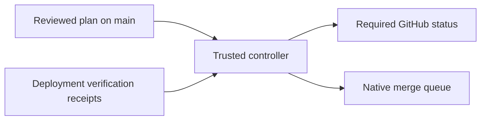

# Merge after deployment

Commit a merge plan to protected `main` to submit exact revisions once.
Hollywood admits candidates after their prerequisites merge and deploy.
GitHub owns reviews, CI, branch rules, and the native merge queue.



```typescript
import { admitGitHubMergePlan, parseGitHubMergePlan } from "@dedalus-labs/hollywood";

const plan = parseGitHubMergePlan({
  repository: "acme/project", base: "main",
  candidates: [
    { pull: 10, head: "0123456789abcdef0123456789abcdef01234567", after: [] },
    { pull: 20, head: "abcdef0123456789abcdef0123456789abcdef0123", after: [
      { pull: 10, deployment: {
        environment: "production", task: "api", publisher: "deploy[bot]",
        workflow: ".github/workflows/deploy-api.yml",
      } },
    ] },
  ],
});
await admitGitHubMergePlan(plan, {
  token: process.env.GITHUB_TOKEN!, mergeToken: process.env.MERGE_USER_TOKEN!,
  mergeActor: "merge-user",
});
```

Omit `deployment` when a prerequisite only needs to merge. Each candidate is an
independent PR or the top of a native stack. Separate stacks at deployment
boundaries. Cycles, duplicate candidates, and unmerged dependencies within one
stack fail closed. Updated candidate heads need a reviewed plan update.

Deployments must satisfy the [verification receipt contract](../reference/deployment-receipts.md).
GitHub ancestry must prove the deployed revision contains the prerequisite's
merge commit. Verification binds to the actual deployed revision, including
batches that deploy several merged PRs together.

`evaluateGitHubMergePlan` returns `ready`, `blocked`, or `merged` with reasons.
Admission submits ready candidates through [merge-async](https://docs.github.com/en/rest/pulls/pulls#merge-a-pull-request-asynchronously),
binding their SHA and requesting `merge_queue`. It verifies that the mutation
token belongs to the configured user. A repeated pending request must match the
same SHA and queue action. Accepted requests still need GitHub's asynchronous
validation. `ready` does not mean enqueued or merged.

## Install the controller workflow

Copy [the workflow source](https://github.com/dedalus-labs/hollywood/blob/main/examples/merge-plan-workflow.ts)
to `gha/merge-plan-workflow.ts`. Save the plan object as JSON in
`gha/merge-plan.json`. Install Hollywood, run `npx hollywood generate`, and commit
the source, plan, generated actions, and workflow to protected `main`.

Install a dedicated GitHub App with Commit statuses write access, plus Contents,
Pull requests, Merge queues, Actions, and Deployments read access. Set `MERGE_APP_ID` and
`MERGE_APP_PRIVATE_KEY`. Set `MERGE_USER_TOKEN` to an authorized user token and
`MERGE_USER_LOGIN` to its login. The user mutates the queue. The App reads state
and writes statuses. Native stacks can reject installation-token enqueuers after
accepting the asynchronous request. Keep both separate from the deployment
publisher. Both identities avoid `GITHUB_TOKEN` workflow-event suppression.

Create the `merge-plan-controller` environment and restrict its deployment
branches to `main`. Store both `MERGE_APP_PRIVATE_KEY` and `MERGE_USER_TOKEN`
only in that environment. Candidate workflow YAML must never receive them.
The controller runs only from `main` on base pushes, manual dispatch, and schedule.
It reads live queue heads each time. Trusted CD can dispatch this workflow on
`main` after deployment to reduce scheduling latency.

Configure the [required dependency check](../reference/merge-plan-gate.md). Scheduled and manual recovery initialize
ordinary PR statuses using one GraphQL read per 100 PRs. It writes only when
the owned status is missing or differs from success. This also clears an old
failure after a PR is dequeued and removed from the plan. Ordinary
PRs are never auto-submitted. They may wait for scheduled recovery before their
first status appears. Run the workflow manually to initialize sooner.

The schedule revisits pending plans. GitHub may delay scheduled runs.
Give the workflow time to publish initial statuses before requiring its context.
